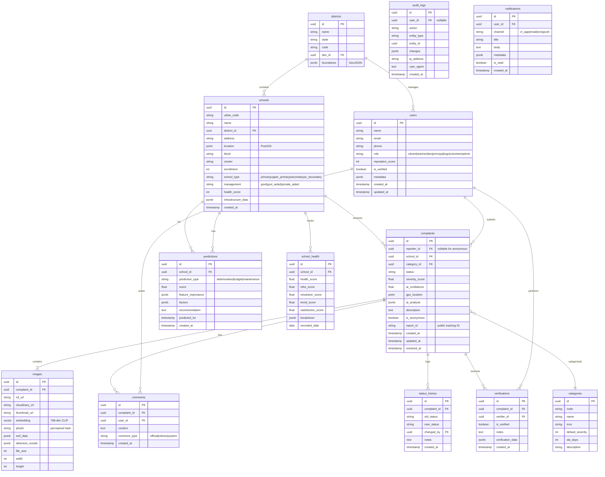
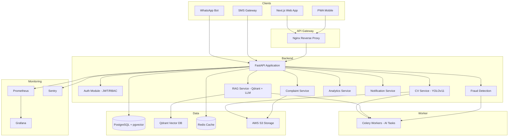
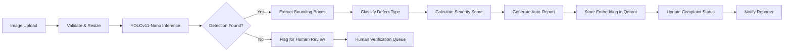
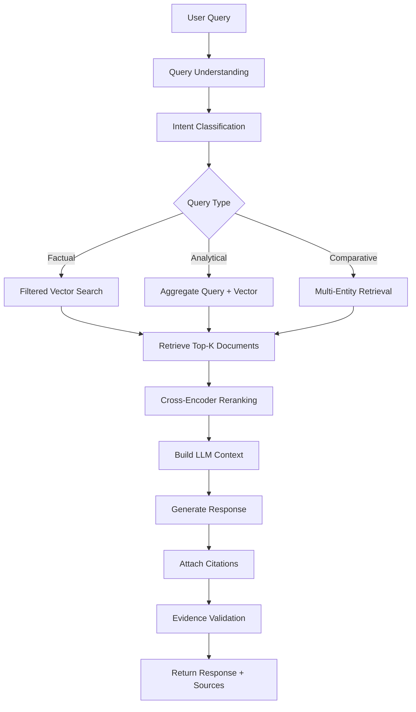

# EduAudit AI — Complete Design Document
## AI-Powered School Infrastructure Monitoring & Transparency System

**Smart India Hackathon | GovTech Innovation | Production Architecture**

---

## Table of Contents

1. [Executive Summary](#1-executive-summary)
2. [PART 1: Problem Analysis](#part-1-problem-analysis)
3. [PART 2: User Personas](#part-2-user-personas)
4. [PART 3: Citizen Reporting System](#part-3-citizen-reporting-system)
5. [PART 4: Computer Vision Module](#part-4-computer-vision-module)
6. [PART 5: AI Auto Report Generation](#part-5-ai-auto-report-generation)
7. [PART 6: Multimodal RAG System](#part-6-multimodal-rag-system)
8. [PART 7: Fraud Detection](#part-7-fraud-detection)
9. [PART 8: Authority Dashboard](#part-8-authority-dashboard)
10. [PART 9: Predictive Analytics](#part-9-predictive-analytics)
11. [PART 10: Database Design](#part-10-database-design)
12. [PART 11: Full Stack Implementation](#part-11-full-stack-implementation)
13. [PART 12: Security](#part-12-security)
14. [PART 13: Deployment](#part-13-deployment)
15. [PART 14: Social Impact](#part-14-social-impact)
16. [PART 15: Hackathon Winning Features](#part-15-hackathon-winning-features)
17. [PART 16: Implementation Roadmap](#part-16-implementation-roadmap)
18. [Final Deliverables](#final-deliverables)

---

## 1. Executive Summary

**EduAudit AI** is an intelligent digital platform that empowers citizens, students, teachers, NGOs, and parents to report infrastructure problems in government schools across India. By combining **crowdsourced evidence collection** with **AI-powered computer vision**, **fraud detection**, **predictive analytics**, and a **multimodal RAG-powered chatbot**, EduAudit transforms the reactive, manual, corruption-prone school inspection process into a proactive, transparent, data-driven system.

### Problem at a Glance
| Metric | Current State | With EduAudit AI |
|--------|--------------|------------------|
| Avg. Inspection Frequency | Once per 2-3 years | Continuous citizen-driven |
| Avg. Issue Resolution Time | 6-18 months | < 15 days (target) |
| Schools Audited/Year (India) | ~15% | 100% (target) |
| Audit Cost per School | ₹8,000-15,000 | < ₹500 |
| Citizen Participation | Near zero | Gamified, multi-channel |
| Fraud/Corruption Incidents | High (untracked) | AI-detected, flagged |

### Core Innovation
> **"Every citizen becomes a school auditor. Every phone becomes an inspection tool. AI ensures every complaint is verified, prioritized, and tracked to resolution."**

### Technology Stack Summary
| Layer | Technology | Rationale |
|-------|-----------|-----------|
| Frontend | Next.js 14 (App Router), TailwindCSS, TypeScript | SSR, SEO, PWA support |
| Backend | FastAPI (Python 3.11+) | Async, ML-native, OpenAPI |
| Database | PostgreSQL + pgvector | Relational + vector search |
| Vector DB | Qdrant | Open-source, Rust-based, filtered search |
| AI/CV | PyTorch, YOLOv11, OpenCV, CLIP | State-of-art detection + embeddings |
| LLM | Gemini 2.0 Flash / OpenAI GPT-4o | RAG chatbot + report generation |
| Storage | AWS S3 + Cloudinary | Media storage + CDN |
| Realtime | Socket.io | Live status updates |
| Auth | JWT + RBAC | Secure, anonymous-capable |
| Infra | Docker, Kubernetes, GitHub Actions | Production-grade CI/CD |
| Monitoring | Prometheus + Grafana | Observability |

---

## PART 1: Problem Analysis

### 1.1 Current Infrastructure Auditing Process

```
┌─────────────┐    ┌──────────────┐    ┌──────────────┐    ┌─────────────┐
│  Govt Order  │───▶│ DEO Assigns │───▶│ Inspector    │───▶│ Manual      │
│  for Audit   │    │ Inspection  │    │ Visits School │    │ Checklist   │
└─────────────┘    └──────────────┘    └──────────────┘    └─────────────┘
                                                                    │
                                                                    ▼
┌─────────────┐    ┌──────────────┐    ┌──────────────┐    ┌─────────────┐
│ Work Order  │◀───│ Budget       │◀───│ Report Filed │◀───│ Report      │
│ Issued      │    │ Approval     │    │ (often late) │    │ Submitted   │
└─────────────┘    └──────────────┘    └──────────────┘    └─────────────┘
```

**Timeline**: 6-24 months from complaint to resolution.

### 1.2 Limitations of Manual Inspections

| Limitation | Description | Impact |
|-----------|-------------|--------|
| **Infrequent** | Inspections happen once every 2-3 years | Issues fester and compound |
| **Subjective** | Inspector judgment varies widely | Inconsistent standards |
| **Incomplete** | Checklist-based, misses nuanced issues | Hidden problems persist |
| **Non-scalable** | ~10.5 lakh schools, few hundred inspectors | Coverage < 15% |
| **Paper-based** | Reports are physical or scattered spreadsheets | No data analytics possible |
| **No follow-up** | No tracking of whether repairs actually happened | Zero accountability |
| **Reactive** | Only after complaints escalate | Preventive maintenance ignored |

### 1.3 Corruption Possibilities

1. **Bribery for favorable reports** — Inspectors accept payments to mark issues as "resolved"
2. **Ghost inspections** — Reports filed without actual site visits
3. **Contractor collusion** — Inflated repair estimates shared with contractors
4. **Data manipulation** — Spreadsheets edited to hide recurring problems
5. **Priority manipulation** — Influential schools get faster repairs
6. **Budget siphoning** — Funds allocated but never spent on actual repairs

### 1.4 Data-Backed Problem Statement

```
India has 10,85,578 government schools (UDISE+ 2023-24)
Only 56.4% have functional toilets for girls
Only 68.3% have drinking water facilities
Only 22.6% have functional computers
Only 53.4% have boundary walls
Annual school infrastructure budget: ~₹11,000 crore
Estimated leakage due to corruption: 30-40%
```

### 1.5 Key Performance Indicators (KPIs)

| KPI | Current Baseline | Target (6 months) | Target (12 months) |
|-----|-----------------|-------------------|-------------------|
| Avg. Resolution Time | 180 days | 30 days | 15 days |
| Schools Covered | 15% | 60% | 95% |
| Audit Cost/School | ₹12,000 | ₹2,000 | ₹500 |
| Citizen Reports/Month | 0 | 5,000 | 25,000 |
| Issue Verification Accuracy | N/A | 85% | 95% |
| Fraud Detection Rate | 0% | 70% | 95% |
| Citizen Engagement Rate | <0.1% | 2% | 8% |
| Schools with Repeated Issues | Unknown | Tracked | <5% |

---

## PART 2: User Personas

### 2.1 Persona Cards

#### 👨‍🎓 Student — Rahul (16, Class 10, Govt. School, Rural Karnataka)
| Aspect | Details |
|--------|---------|
| **Pain Points** | Broken toilets, no clean water, damaged desks, leaking roof during monsoon, no sports equipment |
| **Usage Scenario** | Takes photo of broken toilet with phone, submits via app, tracks status |
| **Expected Benefits** | Safe, dignified learning environment; voice without fear of retaliation |
| **Technical Literacy** | Basic smartphone user, prefers local language interface |

#### 👩‍🏫 Teacher — Priya Sharma (34, Primary School Teacher, UP)
| Aspect | Details |
|--------|---------|
| **Pain Points** | Repeated complaints to DEO ignored, no budget transparency, unsafe electrical wiring, no accountability trail |
| **Usage Scenario** | Submits detailed report with photos + videos, uses WhatsApp integration, checks repair timeline |
| **Expected Benefits** | Institutional memory of complaints, data-driven escalation to authorities |
| **Technical Literacy** | Moderate, uses WhatsApp daily, comfortable with apps |

#### 👨‍👧‍👦 Parent — Suresh Patel (42, Farmer, Gujarat)
| Aspect | Details |
|--------|---------|
| **Pain Points** | Children fall sick due to poor sanitation, no way to report issues, language barrier, doesn't know whom to contact |
| **Usage Scenario** | Voice complaint in Gujarati via WhatsApp bot, receives status in local language |
| **Expected Benefits** | Children's safety, transparent accountability, dignified reporting without literacy requirement |

#### 🏢 NGO — WaterAid India Team
| Aspect | Details |
|--------|---------|
| **Pain Points** | Manual surveys are expensive, no centralized data, can't track repair outcomes, no cross-district comparison |
| **Usage Scenario** | Bulk upload reports from field surveys, access analytics dashboard, download district-level sanitation reports |
| **Expected Benefits** | Data-driven advocacy, targeted intervention, measurable impact tracking |

#### 🤝 Volunteer — Ankit (22, Engineering Student, SIH Participant)
| Aspect | Details |
|--------|---------|
| **Pain Points** | Wants to contribute but no structured platform, can't verify if issues are real, no recognition for contributions |
| **Usage Scenario** | Reports during school visits, verifies other users' reports, earns badges and leaderboard points |
| **Expected Benefits** | Gamified social impact, skill-building, resume-worthy contributions |

#### 🏛️ District Education Officer — Mr. R.K. Singh
| Aspect | Details |
|--------|---------|
| **Pain Points** | Overwhelmed with manual complaints, no data visibility, can't prioritize, no budget tracking, political pressure |
| **Usage Scenario** | Views dashboard with heatmaps, auto-prioritized complaints, AI-estimated repair costs, auto-escalation alerts |
| **Expected Benefits** | Data-driven decisions, reduced workload, transparent accountability, measurable performance metrics |

#### 🏫 School Principal — Mrs. Lakshmi Devi
| Aspect | Details |
|--------|---------|
| **Pain Points** | No control over repair requests, can't track status, blamed for infrastructure failures, no budget visibility |
| **Usage Scenario** | Views school health score, submits internal requests, tracks contractor progress, responds to citizen complaints |
| **Expected Benefits** | Proactive maintenance planning, reduced blame, data-backed budget requests |

### 2.2 Persona Interaction Map

```
                    ┌──────────────┐
                    │   Citizen    │
                    │  (Student,   │
                    │  Parent,     │
                    │  Volunteer)  │
                    └──────┬───────┘
                           │ Reports
                           ▼
                    ┌──────────────┐     ┌──────────────┐
                    │  EduAudit    │────▶│  AI Engine   │
                    │  Platform    │     │  (CV + RAG)  │
                    └──────┬───────┘     └──────────────┘
                           │                        │
              ┌────────────┼────────────┐           │
              ▼            ▼            ▼           ▼
        ┌──────────┐ ┌──────────┐ ┌──────────┐ ┌──────────┐
        │ Teacher  │ │   NGO    │ │ Principal│ │   DEO    │
        │          │ │          │ │          │ │ Dashboard│
        └──────────┘ └──────────┘ └──────────┘ └──────────┘
```

---

## PART 3: Citizen Reporting System

### 3.1 Report Submission Flow

```
┌─────────────────────────────────────────────────────────────────┐
│                    CITIZEN REPORT FLOW                          │
├─────────────────────────────────────────────────────────────────┤
│                                                                 │
│  1. SELECT SCHOOL     2. CAPTURE EVIDENCE    3. DESCRIBE      │
│  ┌──────────────┐     ┌──────────────────┐   ┌──────────────┐  │
│  │ Search by    │     │ 📷 Camera        │   │ Category     │  │
│  │ - Name       │     │ 🖼️ Gallery       │   │ - Broken     │  │
│  │ - GPS Nearby │     │ 🎥 Video          │   │   Toilet     │  │
│  │ - QR Code    │     │ 📝 Voice Note     │   │ - No Water   │  │
│  │ - District   │     │ (up to 5 media)  │   │ - Damaged    │  │
│  └──────────────┘     └──────────────────┘   │   Class      │  │
│                                              │ - Roof Leak   │  │
│                                              └──────┬───────┘  │
│                                                     │          │
│  5. SUBMIT           4. OPTIONAL INFO       ┌───────▼───────┐  │
│  ┌──────────────┐     ┌──────────────────┐   │ Severity     │  │
│  │ Anonymous ✓  │     │ Contact (opt.)   │   │ Auto-estimated│  │
│  │ Offline Mode │     │ Additional notes │   │ by AI        │  │
│  │ GPS Tagged   │     │ Parent consent  │   └──────────────┘  │
│  │ ☑ Terms      │     │ School ID       │                      │
│  └──────────────┘     └──────────────────┘                      │
│                                                                 │
└─────────────────────────────────────────────────────────────────┘
```

### 3.2 Issue Categories

| Category | Code | Severity | SLA (Days) |
|----------|------|----------|------------|
| Broken/Non-functional Toilet | I001 | Critical | 3 |
| No Drinking Water Facility | I002 | Critical | 3 |
| Unsafe Electrical Wiring | I003 | Critical | 1 |
| Damaged Classroom/Structural | I004 | High | 7 |
| Roof Leakage | I005 | High | 7 |
| Broken Furniture (Desk/Chair) | I006 | Medium | 14 |
| Broken Windows/Doors | I007 | Medium | 14 |
| Missing Ramps/Accessibility | I008 | High | 7 |
| Sanitation Issues | I009 | Critical | 3 |
| Boundary Wall Damage | I010 | High | 10 |
| Playground Hazards | I011 | Medium | 14 |
| No Electricity | I012 | High | 5 |
| Library/Lab Issues | I013 | Low | 30 |
| Digital Infrastructure | I014 | Low | 30 |

### 3.3 Report Status Workflow

```
Submitted → Verified → Assigned → Under Repair → Completed → Verified Close
    │            │           │            │             │
    ▼            ▼           ▼            ▼             ▼
 Auto-AI     AI + Human   DEO/Contractor  Progress    Photo
 Screening   Verification  Assignment    Updates     Evidence
 (instant)   (< 24hrs)    (< 48hrs)    (ongoing)    Required
```

**Status Codes:**
- `DRAFT` — User is composing
- `SUBMITTED` — Uploaded, pending AI screening
- `AI_VERIFIED` — AI confirmed issue (high confidence)
- `PENDING_REVIEW` — Needs human verification (lower confidence)
- `VERIFIED` — Human confirmed the issue
- `REJECTED` — False/spam report
- `ASSIGNED` — Assigned to contractor/officer
- `IN_PROGRESS` — Repair work started
- `PENDING_COMPLETION` — Work done, awaiting final verification
- `COMPLETED` — Verified resolved
- `REOPENED` — Issue recurred after completion

### 3.4 Anonymous Reporting Design

```
┌────────────────────────────────────────────────────┐
│            ANONYMOUS REPORTING LAYER                │
├────────────────────────────────────────────────────┤
│                                                    │
│  Report Submission ──▶ Random UUID (not linked to  │
│                        user account)               │
│                                                    │
│  Storage:           ──▶ Encrypted at rest          │
│                        (AES-256)                   │
│                                                    │
│  Tracking:          ──▶ Report ID only (shareable) │
│                                                    │
│  Response:          ──▶ Public status page         │
│                        (no reporter identity)       │
│                                                    │
│  Fraud Prevention:  ──▶ Device fingerprint          │
│                        IP rate limiting             │
│                        Image duplicate check        │
│                                                    │
└────────────────────────────────────────────────────┘
```

### 3.5 Offline Support Architecture

```
Mobile App                          Server
    │                                  │
    ├─── Cache form data               │
    ├─── Store images locally           │
    ├─── Queue reports in SQLite        │
    ├─── Geotag with GPS timestamp      │
    │                                  │
    │   (Network Available)             │
    │                                  │
    ├─── Auto-sync queued reports ─────▶│
    ├─── Upload images sequentially ──▶│
    ├─── Clear local queue             │
    └─── Pull status updates ◀─────────│
```

**Implementation:**
- Local SQLite DB via `expo-sqlite` (React Native) or IndexedDB (PWA)
- Background sync using `react-native-background-fetch` or Service Worker
- Conflict resolution: timestamp-based, server-wins for status updates

---

## PART 4: Computer Vision Module

### 4.1 Model Comparison and Recommendation

| Model | Params | mAP@0.5 | Inference (ms) | Model Size | Mobile Deploy | Best For |
|-------|--------|---------|----------------|------------|---------------|----------|
| **MobileNetV3** | 5.4M | 72.4% | 15-25ms | 16MB | ✅ Excellent | Classification only |
| **EfficientNet-B0** | 5.3M | 74.1% | 20-30ms | 20MB | ✅ Good | Classification only |
| **ResNet50** | 25.6M | 78.3% | 40-60ms | 98MB | ⚠️ Possible | Classification, robust |
| **YOLOv11-Nano** | 2.6M | 76.8% | 8-12ms | 6MB | ✅ Excellent | Detection + localization |
| **YOLOv11-Small** | 9.4M | 82.1% | 18-25ms | 18MB | ✅ Good | Detection + localization |

### 🏆 Recommendation: YOLOv11-Nano (Primary) + YOLOv11-Small (Cloud Fallback)

**Rationale:**
1. **Detection, not just classification** — YOLO localizes the defect within the image (bounding box), enabling severity assessment and multi-defect detection
2. **Real-time on mobile** — 8-12ms inference on Snapdragon/Generic mobile NPUs
3. **Multi-defect per image** — A single photo can detect broken desk + wall crack + wiring issue simultaneously
4. **State-of-art accuracy** — YOLOv11 achieves best accuracy-speed tradeoff in 2024
5. **Ecosystem maturity** — Ultralytics HUB for dataset management, training, and deployment
6. **Edge deployment ready** — Export to ONNX, TensorRT, TFLite, CoreML

### 4.2 Detection Classes

```yaml
classes:
  - id: 0
    name: "broken_toilet"
    display: "Broken Toilet"
    severity: "critical"
    sla_days: 3
  - id: 1
    name: "damaged_wall"
    display: "Damaged Wall/Ceiling"
    severity: "high"
    sla_days: 7
  - id: 2
    name: "roof_leakage"
    display: "Roof Leakage"
    severity: "high"
    sla_days: 7
  - id: 3
    name: "no_water_facility"
    display: "No Water Facility"
    severity: "critical"
    sla_days: 3
  - id: 4
    name: "unsafe_wiring"
    display: "Unsafe Electrical Wiring"
    severity: "critical"
    sla_days: 1
  - id: 5
    name: "broken_furniture"
    display: "Broken Furniture"
    severity: "medium"
    sla_days: 14
  - id: 6
    name: "poor_sanitation"
    display: "Poor Sanitation"
    severity: "critical"
    sla_days: 3
  - id: 7
    name: "structural_damage"
    display: "Structural Damage"
    severity: "high"
    sla_days: 5
  - id: 8
    name: "broken_window_door"
    display: "Broken Window/Door"
    severity: "medium"
    sla_days: 14
  - id: 9
    name: "playground_hazard"
    display: "Playground Hazard"
    severity: "medium"
    sla_days: 14
```

### 4.3 Transfer Learning Strategy

```
┌──────────────────────────────────────────────────────────────┐
│                  TRANSFER LEARNING PIPELINE                   │
├──────────────────────────────────────────────────────────────┤
│                                                              │
│  Step 1: Pre-trained Backbone                                │
│  ┌─────────────────────────────────────────┐                 │
│  │  COCO-pretrained YOLOv11-Nano           │                 │
│  │  (80 classes, 700K+ images)            │                 │
│  │  Already knows: objects, edges,         │                 │
│  │  textures, lighting patterns            │                 │
│  └─────────────────┬───────────────────────┘                 │
│                    │ Freeze backbone (first 50 epochs)        │
│                    ▼                                         │
│  Step 2: Domain Adaptation                                  │
│  ┌─────────────────────────────────────────┐                 │
│  │  Indian School Infrastructure Dataset   │                 │
│  │  (10,000+ annotated images)             │                 │
│  │  Classes: 10 defect types               │                 │
│  │  Annotation: Roboflow + manual          │                 │
│  └─────────────────┬───────────────────────┘                 │
│                    │ Fine-tune all layers (next 100 epochs)  │
│                    ▼                                         │
│  Step 3: Specialization                                     │
│  ┌─────────────────────────────────────────┐                 │
│  │  State-specific fine-tuning              │                 │
│  │  (climate, building style variations)   │                 │
│  │  Active learning from field reports     │                 │
│  └─────────────────────────────────────────┘                 │
│                                                              │
└──────────────────────────────────────────────────────────────┘
```

### 4.4 Dataset Collection Strategy

| Source | Method | Quantity | Quality |
|--------|--------|----------|---------|
| **Field Collection** | Partner NGOs photograph schools during surveys | 5,000+ | High |
| **Open Source** | Google Images (filtered), Kaggle infrastructure datasets | 2,000+ | Medium |
| **Synthetic** | Blender3D/Unreal Engine simulated school environments | 3,000+ | Medium |
| **Citizen Reports** | Production data (after launch) | Continuous | Variable |
| **Government Archives** | RTI-obtained inspection photos | 1,000+ | High |

**Target: 10,000+ images at launch, growing to 50,000+ within 6 months**

### 4.5 Image Annotation Protocol

```
Tool: Roboflow / CVAT / Label Studio

Annotation Guidelines:
1. Tight bounding boxes around the defect (not the whole room)
2. Occluded defects: annotate visible portion only
3. Multiple defects: annotate each separately
4. Severity tagging: minor / moderate / severe (per annotation)
5. Minimum confidence threshold for annotators: 80% agreement
6. Quality audit: 20% of annotations reviewed by expert

Format: YOLOv11 compatible
  class_id center_x center_y width height
  Example: 0 0.523 0.612 0.342 0.456
```

### 4.6 Data Augmentation Pipeline

```python
augmentation_pipeline = {
    "geometric": [
        "RandomHorizontalFlip (p=0.5)",
        "RandomRotation (±15°, p=0.3)",
        "RandomScale (0.8-1.2, p=0.3)",
        "RandomTranslation (±10%, p=0.3)",
        "PerspectiveTransform (p=0.2)",
    ],
    "photometric": [
        "RandomBrightness (±30%, p=0.4)",
        "RandomContrast (±30%, p=0.4)",
        "RandomSaturation (±20%, p=0.3)",
        "GaussianNoise (σ=10, p=0.2)",
        "JPEGCompression (quality 70-95, p=0.3)",
    ],
    "domain_specific": [
        "SimulateLowLight (p=0.3)",
        "SimulateWaterDamage (brown tint, p=0.1)",
        "SimulateDustHaze (p=0.2)",
        "MosaicAugmentation (4-image grid, p=0.5)",
        "MixUp (p=0.1)",
        "CopyPaste (defect insertion, p=0.15)",
    ],
}
```

### 4.7 Model Compression for Edge Deployment

```
YOLOv11-Nano Training (FP32)
        │
        ▼
  Post-Training Quantization (PTQ)
  (FP32 → INT8)
        │
        ▼
  Knowledge Distillation
  (YOLOv11-S → YOLOv11-N)
        │
        ▼
  Export Formats:
  ├── ONNX Runtime (cross-platform)
  ├── TensorRT (NVIDIA Jetson)
  ├── TFLite (Android)
  ├── CoreML (iOS)
  └── OpenVINO (Intel)
        │
        ▼
  Final Size: ~3MB (INT8)
  Inference: ~5ms on mobile
```

### 4.8 Expected Performance Metrics

| Metric | Target | Notes |
|--------|--------|-------|
| **mAP@0.5** | ≥ 85% | On validation set |
| **mAP@0.5:0.95** | ≥ 65% | Strict IoU |
| **Precision** | ≥ 88% | Minimize false positives |
| **Recall** | ≥ 82% | Don't miss critical issues |
| **F1 Score** | ≥ 85% | Balanced |
| **Inference Time (Cloud)** | < 100ms | GPU server |
| **Inference Time (Mobile)** | < 20ms | ONNX INT8 |
| **Model Size (Mobile)** | < 5MB | After compression |

---

## PART 5: AI Auto Report Generation

### 5.1 Automated Report Structure

When a citizen submits a report with images, the system automatically:

```
┌─────────────────────────────────────────────────────────────┐
│                 AI AUTO-REPORT GENERATION                    │
├─────────────────────────────────────────────────────────────┤
│                                                             │
│  Image Upload ──▶ YOLOv11 Detection ──▶ Structured Report  │
│                                                             │
│  ┌─────────────────────────────────────────────────────┐    │
│  │  EduAudit AI — Automated Infrastructure Report      │    │
│  │  ──────────────────────────────────────────────     │    │
│  │  Report ID: RPT-2026-0624-00547                     │    │
│  │  Generated: 2026-06-24 14:32:17 IST                 │    │
│  │                                                     │    │
│  │  🏫 School: Govt. Sr. Sec. School, Rudrapur         │    │
│  │  📍 Location: 28.62°N, 79.42°E                      │    │
│  │  🏷️ District: Udham Singh Nagar, Uttarakhand        │    │
│  │  📊 UDISE Code: UK050212001                         │    │
│  │                                                     │    │
│  │  🔍 ISSUE DETECTED:                                 │    │
│  │  ┌──────────────────────────────────────────┐      │    │
│  │  │ Primary: Non-functional Toilet           │      │    │
│  │  │ Secondary: Poor Sanitation              │      │    │
│  │  │ Location: Ground Floor, Block B          │      │    │
│  │  └──────────────────────────────────────────┘      │    │
│  │                                                     │    │
│  │  📈 SEVERITY ASSESSMENT:                            │    │
│  │  ┌──────────────────────────────────────────┐      │    │
│  │  │ Severity Score: 9.2 / 10                  │      │    │
│  │  │ Classification: CRITICAL                   │      │    │
│  │  │ Suggested Priority: HIGH                  │      │    │
│  │  │ Recommended SLA: 3 days                   │      │    │
│  │  └──────────────────────────────────────────┘      │    │
│  │                                                     │    │
│  │  🤖 AI CONFIDENCE:                                 │    │
│  │  ┌──────────────────────────────────────────┐      │    │
│  │  │ Toilet Detection: 96.3%                   │      │    │
│  │  │ Sanitation Issue: 89.1%                  │      │    │
│  │  │ Overall: 93.7%                            │      │    │
│  │  │ Model: YOLOv11-Nano v2.1                  │      │    │
│  │  └──────────────────────────────────────────┘      │    │
│  │                                                     │    │
│  │  📸 Evidence: 3 images, 1 video                     │    │
│  │  💰 Estimated Repair Cost: ₹15,000 - ₹25,000       │    │
│  │  🔧 Suggested Action: Immediate plumber dispatch    │    │
│  │                                                     │    │
│  │  ⚠️ This report was auto-generated by AI.          │    │
│  │     Human verification recommended.                │    │
│  └─────────────────────────────────────────────────────┘    │
│                                                             │
└─────────────────────────────────────────────────────────────┘
```

### 5.2 Severity Scoring Algorithm

```python
def calculate_severity_score(detection_result: dict) -> float:
    """
    Multi-factor severity scoring (0-10 scale)
    """
    base_score = detection_result['class_severity_map'][class_name]
    
    # Factor 1: Confidence (higher confidence = more certain issue exists)
    confidence_factor = detection_result['confidence'] / 100.0
    
    # Factor 2: Damage extent (bounding box area relative to image)
    area_ratio = detection_result['bbox_area'] / detection_result['image_area']
    extent_factor = min(area_ratio * 5, 1.0)  # Cap at 1.0
    
    # Factor 3: Historical context (repeated issues = higher severity)
    school_history = get_school_complaint_history(school_id)
    recurrence_factor = min(school_history['repeat_count'] * 0.1, 0.5)
    
    # Factor 4: Student impact (number of affected students)
    student_factor = min(school_history['enrollment'] / 500, 1.0)
    
    # Factor 5: Seasonal adjustment (roof leaks worse in monsoon)
    seasonal_factor = get_seasonal_multiplier(class_name, current_month)
    
    # Weighted combination
    severity = (
        base_score * 0.30 +
        confidence_factor * 0.20 +
        extent_factor * 0.15 +
        recurrence_factor * 0.15 +
        student_factor * 0.10 +
        seasonal_factor * 0.10
    )
    
    return round(min(severity * 10, 10.0), 1)
```

### 5.3 Repair Cost Estimation (AI)

```python
# Cost estimation matrix (regional-adjusted)
repair_costs = {
    "broken_toilet": {
        "minor": (5000, 12000),    # Handle, seat, minor pipe
        "moderate": (12000, 30000), # Full commode replacement
        "severe": (30000, 80000),   # Complete bathroom renovation
    },
    "roof_leakage": {
        "minor": (8000, 20000),
        "moderate": (20000, 80000),
        "severe": (80000, 200000),
    },
    "unsafe_wiring": {
        "minor": (3000, 10000),
        "moderate": (10000, 50000),
        "severe": (50000, 150000),
    },
    # ... all classes
}

def estimate_repair_cost(class_name, severity, state, num_units):
    """Estimate with regional cost index adjustment"""
    base_min, base_max = repair_costs[class_name][severity]
    
    # State-wise cost index (India CPI-based)
    state_index = COST_INDICES.get(state, 1.0)
    
    min_cost = base_min * state_index * num_units
    max_cost = base_max * state_index * num_units
    
    return {
        "min": round(min_cost),
        "max": round(max_cost),
        "recommended": round((min_cost + max_cost) / 2),
        "currency": "INR",
        "confidence": "approximate"
    }
```

---

## PART 6: Multimodal RAG System

### 6.1 Vector Database Comparison

| Feature | Pinecone | Weaviate | Qdrant |
|---------|----------|----------|--------|
| **License** | Proprietary | BSD (Open) | Apache 2.0 (Open) |
| **Self-hosted** | ❌ | ✅ | ✅ |
| **Performance** | Good | Good | Excellent (Rust) |
| **Filtered Search** | ✅ | ✅ | ✅ (Best) |
| **Multi-vector** | ✅ | ✅ | ✅ |
| **Geo-search** | ✅ | ✅ | ✅ (Native) |
| **Max Vectors (Free)** | 100K | N/A (self-host) | Unlimited |
| **Hybrid Search** | ✅ | ✅ | ✅ |
| **gRPC Support** | ✅ | ✅ | ✅ (Native) |
| **Indian Server** | ❌ | ❌ | ✅ (Self-host) |

### 🏆 Recommendation: Qdrant (Self-hosted)

**Rationale:**
1. **Open-source Apache 2.0** — No vendor lock-in, critical for GovTech
2. **Rust-based** — Fastest vector similarity search, sub-millisecond latency
3. **Native filtering** — Essential for "all complaints from District X in March" queries
4. **Geo-search** — Perfect for location-based school queries
5. **Self-hostable** — Data stays within India (compliance with DPDP Act 2023)
6. **pgvector integration** — Can work alongside PostgreSQL seamlessly
7. **Multi-vector support** — Store CLIP image + text embeddings side by side

### 6.2 RAG Architecture

```
┌──────────────────────────────────────────────────────────────────┐
│                    MULTIMODAL RAG ARCHITECTURE                    │
├──────────────────────────────────────────────────────────────────┤
│                                                                  │
│  DATA SOURCES                   EMBEDDING PIPELINE               │
│  ┌──────────────┐               ┌──────────────────┐             │
│  │ Images       │──CLIP v2────▶│ Image Embeddings │             │
│  │ (768-dim)    │              │ (768-dim)        │             │
│  ├──────────────┤               ├──────────────────┤             │
│  │ Reports      │──BGE-M3─────▶│ Text Embeddings  │             │
│  │ (structured)│              │ (1024-dim)       │             │
│  ├──────────────┤               ├──────────────────┤             │
│  │ Comments     │──BGE-M3─────▶│ Comment Embeds   │             │
│  │ (free text) │              │                  │             │
│  ├──────────────┤               └────────┬─────────┘             │
│  │ Audit History│──BGE-M3─────▶│         │                       │
│  │ School Meta  │              │         ▼                       │
│  └──────────────┘              │  ┌──────────────┐                │
│                                │  │    QDRANT    │                │
│  RETRIEVAL                      │  │  Vector DB   │                │
│  ┌──────────────────────────┐  │  │              │                │
│  │ User Query                │  │  │ Collections: │                │
│  │ "Show sanitation issues  │──┼─▶│ - reports     │                │
│  │  in District X"           │  │  │ - images      │                │
│  └──────────┬───────────────┘  │  │ - schools     │                │
│             │                  │  │ - comments    │                │
│             ▼                  │  └──────┬───────┘                │
│  ┌──────────────────────────┐  │         │                        │
│  │ Hybrid Search:           │  │         │ Top-K Results           │
│  │ - Semantic (embedding)   │◀─┼─────────┘                        │
│  │ - Keyword (BM25)         │  │                                  │
│  │ - Filter (district,      │  │  GENERATION                      │
│  │   date, category)       │  │  ┌──────────────────┐             │
│  │ - Geo (location-based)  │  │  │ LLM (Gemini/     │             │
│  └──────────┬───────────────┘  │  │ GPT-4o)         │             │
│             │                  │  │                  │             │
│             ▼                  │  │ Context:          │             │
│  ┌──────────────────────────┐  │  │ - Retrieved docs  │             │
│  │ Reranking:               │  │  │ - System prompt   │             │
│  │ Cohere Rerank /         │──┼─▶│ - User query      │             │
│  │ Cross-Encoder            │  │  │                  │             │
│  └──────────┬───────────────┘  │  └────────┬─────────┘             │
│             │                  │           │                       │
│             ▼                  │           ▼                       │
│  ┌──────────────────────────┐  │  ┌──────────────────┐             │
│  │ EVIDENCE-BACKED         │  │  │ Response with:    │             │
│  │ RESPONSE with:           │  │  │ - Summary        │             │
│  │ - Data points            │  │  │ - Citations [1][2]│             │
│  │ - Source links           │  │  │ - Charts          │             │
│  │ - Confidence level      │  │  │ - Action items    │             │
│  └──────────────────────────┘  │  └──────────────────┘             │
│                                                                  │
└──────────────────────────────────────────────────────────────────┘
```

### 6.3 Chatbot Query Examples

| Query | Retrieval Strategy | Response Type |
|-------|-------------------|---------------|
| "Summarize all sanitation complaints from District X in March" | Filter: district=X, date=Mar, category=sanitation → Semantic search → Aggregate | Summary + Statistics + Report links |
| "Show schools with repeated issues" | Query school embeddings → Count repeat complaints → Rank by frequency | Table + Heatmap link |
| "List schools awaiting repairs" | Filter: status=IN_PROGRESS/ASSIGNED → Sort by duration | Table with SLA breach alerts |
| "Which district has the worst toilet infrastructure?" | Aggregate: category=toilet per district → Rank → Top 5 | Bar chart + Comparison |
| "Compare infrastructure between School A and School B" | Retrieve both school reports → Side-by-side | Comparison matrix |
| "What is the status of complaint RPT-2026-00547?" | Lookup by report ID → Full history | Timeline + Current status |

### 6.4 Embedding Strategy

```python
# Image embeddings: CLIP ViT-L/14 (768-dim)
# Text embeddings: BGE-M3 (1024-dim) — multilingual

# Hybrid search weights
search_config = {
    "semantic_weight": 0.7,    # Vector similarity
    "keyword_weight": 0.3,     # BM25 sparse search
    "rerank_top_k": 20,        # Candidates before reranking
    "final_top_k": 5,          # Results sent to LLM
}

# Collection schema (Qdrant)
collection_config = {
    "vectors": {
        "image": {"size": 768, "distance": "Cosine"},
        "text": {"size": 1024, "distance": "Cosine"},
    },
    "payload_schema": {
        "report_id": "keyword",
        "school_id": "keyword",
        "district": "keyword",
        "state": "keyword",
        "category": "keyword",
        "severity": "integer",
        "status": "keyword",
        "created_at": "datetime",
        "location": "geo",
    }
}
```

---

## PART 7: Fraud Detection

### 7.1 Fraud Vectors and Countermeasures

```
┌────────────────────────────────────────────────────────────────┐
│                    FRAUD DETECTION SYSTEM                       │
├────────────────────────────────────────────────────────────────┤
│                                                                │
│  ATTACK VECTOR          DETECTION METHOD         ACTION       │
│  ─────────────────────────────────────────────────────────     │
│                                                                │
│  Fake/Staged Photos     CLIP Embedding          Flag for      │
│  (uploaded from         + Image Forensics        human review  │
│   internet)             (EXIF analysis)                       │
│                                                                │
│  Duplicate Reports      Perceptual Hashing      Auto-reject    │
│  (same image            (pHash + dHash)         with notice   │
│   re-uploaded)          + CLIP similarity                     │
│                                                                │
│  Edited Images          Error Level Analysis    Flag for      │
│  (Photoshopped)         + Metadata analysis     expert review │
│                         + ELA heat maps                        │
│                                                                │
│  Spam/Bot Reports       Rate limiting           Auto-block     │
│                         + Device fingerprint   after 3 strikes │
│                         + CAPTCHA challenge                   │
│                         + Behavioral analysis                 │
│                                                                │
│  Malicious Targeting    NLP sentiment analysis   Flag for      │
│  (false reports to      + Pattern detection     admin review  │
│   harass schools)       + User reputation                     │
│                                                                │
│  Location Spoofing      GPS validation         Auto-flag      │
│  (fake GPS coords)      + WiFi triangulation   + require     │
│                         + Cell tower matching   additional    │
│                                                evidence       │
│                                                                │
└────────────────────────────────────────────────────────────────┘
```

### 7.2 Implementation: Perceptual Hashing + CLIP

```python
class FraudDetector:
    def __init__(self):
        self.clip_model = load_clip("ViT-L/14")
        self.hash_db = RedisBitmap()  # Fast perceptual hash lookup
        
    async def check_image(self, image_bytes: bytes) -> FraudResult:
        """Multi-layer fraud check"""
        
        # Layer 1: Perceptual Hash (instant, < 1ms)
        p_hash = perceptual_hash(image_bytes)
        similar_hashes = self.hash_db.find_similar(p_hash, threshold=5)
        if similar_hashes:
            return FraudResult(
                is_fraud=True,
                reason="duplicate_image",
                similar_report=similar_hashes[0],
                confidence=0.95
            )
        
        # Layer 2: CLIP Embedding (fast, ~50ms)
        clip_embedding = self.clip_model.encode(image_bytes)
        nearest = self.vector_db.search(clip_embedding, top_k=3, threshold=0.92)
        if nearest:
            return FraudResult(
                is_fraud=True,
                reason="near_duplicate",
                similar_reports=nearest,
                confidence=nearest[0].score
            )
        
        # Layer 3: EXIF Metadata Analysis
        exif_data = extract_exif(image_bytes)
        if exif_data and not is_plausible_school_photo(exif_data):
            return FraudResult(
                is_fraud=True,
                reason="metadata_mismatch",
                confidence=0.7
            )
        
        # Layer 4: Error Level Analysis (for edited images)
        ela_score = compute_ela(image_bytes)
        if ela_score > THRESHOLD_EDITED:
            return FraudResult(
                is_fraud=True,
                reason="possibly_edited",
                confidence=ela_score,
                requires_human_review=True
            )
        
        # Store for future duplicate checks
        self.hash_db.store(p_hash, report_id)
        self.vector_db.store(clip_embedding, report_id)
        
        return FraudResult(is_fraud=False, confidence=0.95)
```

### 7.3 User Reputation System

```python
class ReputationSystem:
    """
    Community trust score: 0-100
    Affects: report priority, verification requirements, features access
    """
    
    reputation_events = {
        "verified_report": +10,
        "helpful_comment": +2,
        "report_completed": +5,
        "false_report": -25,
        "spam_report": -50,
        "duplicate_report": -15,
        "streak_7_days": +20,     # Bonus for consistent reporting
        "verified_volunteer": +30, # NGO/volunteer badge
    }
    
    reputation_levels = {
        (0, 30): "New",           # All reports need verification
        (30, 60): "Trusted",      # AI-verified reports auto-accepted
        (60, 85): "Contributor",  # Priority processing
        (85, 100): "Champion",   # Report weight = 2x, badge access
    }
```

---

## PART 8: Authority Dashboard

### 8.1 District Education Officer Dashboard Layout

```
┌─────────────────────────────────────────────────────────────────────┐
│  🏛️ EduAudit AI — District Officer Dashboard    DEO: R.K. Singh   │
│  District: Udham Singh Nagar    Last updated: 2 min ago             │
├─────────────────────────────────────────────────────────────────────┤
│                                                                     │
│  ┌─────────┐ ┌─────────┐ ┌─────────┐ ┌─────────┐ ┌─────────┐       │
│  │  🔴 47  │ │  🟡 23  │ │  🟢 156 │ │  ⚠️ 8   │ │  📊 72% │       │
│  │Critical │ │ Pending │ │Resolved │ │ SLA     │ │ Health  │       │
│  │Pending  │ │ Review  │ │ This Mo.│ │ Breach  │ │ Score   │       │
│  └─────────┘ └─────────┘ └─────────┘ └─────────┘ └─────────┘       │
│                                                                     │
│  ┌─────────────────────────────────┐ ┌───────────────────────────┐ │
│  │ DISTRICT HEATMAP                │ │ ISSUE SEVERITY RANKING     │ │
│  │                                 │ │                           │ │
│  │  [Interactive map with school  │ │  1. Broken Toilets   (42) │ │
│  │   locations, color-coded by    │ │  2. No Water          (28) │ │
│  │   issue density and severity]   │ │  3. Roof Leakage      (19) │ │
│  │                                 │ │  4. Unsafe Wiring     (12) │ │
│  │  🔴 = Critical  🟡 = Warning   │ │  5. Broken Furniture  (9)  │ │
│  │  🟢 = Healthy   ⚪ = No data   │ │  6. Boundary Wall     (6)  │ │
│  │                                 │ │  7. Sanitation       (5)  │ │
│  └─────────────────────────────────┘ └───────────────────────────┘ │
│                                                                     │
│  ┌─────────────────────────────────┐ ┌───────────────────────────┐ │
│  │ REPAIR PROGRESS TIMELINE       │ │ BUDGET ESTIMATION         │ │
│  │                                 │ │                           │ │
│  │  ████████████████░░░░░ 72%      │ │  Total Estimated: ₹24.5L  │ │
│  │  Completed: 156                │ │  Allocated:     ₹18.0L    │ │
│  │  In Progress: 45               │ │  Spent:         ₹12.3L    │ │
│  │  Pending: 47                   │ │  Gap:           ₹6.5L      │ │
│  │  Overdue: 8                    │ │                           │ │
│  │                                 │ │  By Category:             │ │
│  │  Avg Resolution: 12 days       │ │  🚽 Sanitation: ₹8.2L    │ │
│  │  Target: 15 days ✅            │ │  🏠 Structure:   ₹7.1L    │ │
│  └─────────────────────────────────┘ │  💡 Electrical:  ₹3.8L   │ │
│                                       │  🪑 Furniture:    ₹2.9L   │ │
│  ┌─────────────────────────────────┐ │  🏗️ Other:       ₹2.5L   │ │
│  │ SCHOOL HEALTH SCORES (Top 10) │ └───────────────────────────┘ │
│  │                                 │                                │
│  │  1. GPS Rudrapur      95/100   │  ┌───────────────────────────┐│
│  │  2. GHS Kashipur       91/100  │  │ AI INSIGHTS               ││
│  │  3. GPS Sitarganj      88/100  │  │                           ││
│  │  4. GGS Kichha         82/100  │  │ ⚠️ 3 schools show         ││
│  │  5. GPS Jaspur         78/100  │  │    recurring toilet issues ││
│  │  ...                         │  │    (monsoon pattern)       ││
│  │                                 │  │                           ││
│  │  ⬇️ Bottom 5:                │  │ 💡 Budget shortfall of     ││
│  │  GPS Bazpur           34/100  │  │    ₹6.5L predicted for     ││
│  │  GPS Khatima          38/100  │  │    Q3 based on trend       ││
│  │  GMS Gadarpur         42/100  │  │                           ││
│  └─────────────────────────────────┘ └───────────────────────────┘│
│                                                                     │
└─────────────────────────────────────────────────────────────────────┘
```

### 8.2 School Health Score Formula

```python
def calculate_school_health_score(school_id: str) -> dict:
    """
    Composite health score: 0-100
    Weighted across multiple dimensions
    """
    
    # Dimension 1: Infrastructure Integrity (40% weight)
    infrastructure_score = (
        100 - (
            open_critical_issues * 15 +
            open_high_issues * 8 +
            open_medium_issues * 3 +
            open_low_issues * 1
        )
    )
    
    # Dimension 2: Resolution Efficiency (25% weight)
    resolution_score = (
        avg_resolution_time < 7 ? 100 :
        avg_resolution_time < 14 ? 80 :
        avg_resolution_time < 30 ? 60 :
        avg_resolution_time < 60 ? 40 : 20
    )
    
    # Dimension 3: Trend Direction (20% weight)
    trend_score = analyze_issue_trend(school_id, last_6_months)
    # Improving: 80-100, Stable: 50-80, Declining: 0-50
    
    # Dimension 4: Citizen Satisfaction (15% weight)
    satisfaction_score = calculate_satisfaction_rating(
        completed_reports
    )
    
    health_score = (
        infrastructure_score * 0.40 +
        resolution_score * 0.25 +
        trend_score * 0.20 +
        satisfaction_score * 0.15
    )
    
    return {
        "school_id": school_id,
        "health_score": round(health_score),
        "grade": get_grade(health_score),  # A+, A, B, C, D, F
        "dimensions": {
            "infrastructure": infrastructure_score,
            "resolution": resolution_score,
            "trend": trend_score,
            "satisfaction": satisfaction_score,
        },
        "risk_level": "high" if health_score < 40 else "medium" if health_score < 70 else "low"
    }
```

### 8.3 Dashboard Technologies

- **Charts**: Recharts (React) / Chart.js
- **Maps**: Leaflet + OpenStreetMap (open source) or Mapbox
- **Realtime**: Socket.io for live updates
- **Export**: PDF reports via Puppeteer, Excel via SheetJS
- **Heatmaps**: WebGL-based density rendering

---

## PART 9: Predictive Analytics

### 9.1 Model Comparison

| Model | Accuracy | Training Speed | Memory | Feature Importance | Best For |
|-------|----------|---------------|--------|-------------------|----------|
| **Random Forest** | 82% | Medium | Medium | ✅ Built-in | Interpretable baseline |
| **XGBoost** | 87% | Fast | Low | ✅ SHAP values | Tabular prediction |
| **LightGBM** | 88% | Very Fast | Very Low | ✅ SHAP values | Large datasets, speed |

### 🏆 Recommendation: LightGBM (Primary) + XGBoost (Ensemble)

**Rationale:**
1. **Fastest training** — Critical for retraining on growing data
2. **Low memory** — Runs on standard cloud instances
3. **Best accuracy on tabular** — Beats neural networks on structured data
4. **Native categorical handling** — No need for one-hot encoding
5. **SHAP explainability** — Feature importance for GovTech transparency
6. **Production proven** — Used by Microsoft, Amazon, etc.

### 9.2 Prediction Tasks

#### Task 1: School Deterioration Prediction
```python
"""
Predict: Will this school develop critical issues in next 90 days?
Features:
- Historical complaint count by category
- School age and building type
- Last inspection date
- Enrollment trend
- Weather zone (monsoon severity)
- Previous repair count
- Budget allocation history
- Nearby school issues (spatial correlation)
- Student-to-infrastructure ratio
"""
features = [
    "complaints_last_30d", "complaints_last_90d", "complaints_last_365d",
    "avg_resolution_time", "repeat_issue_rate", "school_age_years",
    "building_type_encoded", "enrollment_count", "student_infra_ratio",
    "last_inspection_days_ago", "budget_per_student", "monsoon_zone",
    "nearby_critical_count", "toilet_student_ratio", "water_availability",
    "electricity_reliability", "boundary_wall_status",
]
```

#### Task 2: Budget Requirement Forecasting
```python
"""
Predict: How much budget does District X need for next quarter?
Method: Time-series + regression ensemble
- Historical repair costs
- Seasonal patterns (monsoon = more roof leaks)
- Inflation adjustment
- Pending repair backlog
- Predicted new issues (from Task 1)
"""
```

### 9.3 SHAP Explainability for Transparency

```
┌──────────────────────────────────────────────┐
│  Why is School X predicted to deteriorate?   │
│                                              │
│  Feature              Impact                 │
│  ──────────────────────────────────────────  │
│  ▓▓▓▓▓▓▓▓▓▓▓▓▓▓▓░░  Complaints ↑ (30 days) │
│  ▓▓▓▓▓▓▓▓▓▓▓▓░░░░░░  No inspection (180d)  │
│  ▓▓▓▓▓▓▓▓▓░░░░░░░░░  Repeat toilet issues  │
│  ▓▓▓▓▓▓░░░░░░░░░░░░  High enrollment       │
│  ▓▓▓░░░░░░░░░░░░░░░░  Monsoon zone          │
│  ░░░▓▓▓▓░░░░░░░░░░░░  Budget allocated (↓)   │
│                                              │
│  Prediction: 87% risk of critical issue      │
│  Recommended: Pre-emptive inspection         │
│  Estimated savings: ₹45,000 (vs emergency)   │
└──────────────────────────────────────────────┘
```

---

## PART 10: Database Design

### 10.1 Entity Relationship Diagram (Mermaid)



### 10.2 Key Design Decisions

1. **UUIDs instead of auto-increment** — Prevents ID enumeration attacks, works across distributed systems
2. **PostGIS for location** — Native geographic queries (within X km, district boundaries)
3. **pgvector for embeddings** — Single database for relational + vector search
4. **JSONB for flexible data** — `ai_analysis`, `detection_results`, `infrastructure_data` evolve without schema migrations
5. **Soft deletes everywhere** — Compliance with government record-keeping requirements
6. **Separate status_history** — Full audit trail of every status change
7. **Reporter ID nullable** — Enables anonymous reporting while maintaining fraud detection

---

## PART 11: Full Stack Implementation

### 11.1 Architecture Overview

```
┌──────────────────────────────────────────────────────────────────┐
│                      SYSTEM ARCHITECTURE                         │
├──────────────────────────────────────────────────────────────────┤
│                                                                  │
│  ┌─────────────────────────────────────────────────────────┐    │
│  │                    CLIENTS                               │    │
│  │  ┌──────────┐  ┌──────────┐  ┌──────────┐  ┌─────────┐ │    │
│  │  │ Next.js  │  │ PWA      │  │ WhatsApp │  │ Mobile  │ │    │
│  │  │ Web App  │  │ (Offline)│  │ Bot      │  │ App     │ │    │
│  │  └────┬─────┘  └────┬─────┘  └────┬─────┘  └────┬────┘ │    │
│  └───────┼──────────────┼──────────────┼──────────────┼──────┘    │
│          │              │              │              │           │
│          └──────────────┴──────────────┴──────────────┘           │
│                            │                                     │
│                     API Gateway (Nginx)                          │
│                            │                                     │
│  ┌─────────────────────────┼─────────────────────────────────┐   │
│  │                    BACKEND SERVICES                        │   │
│  │                         │                                  │   │
│  │  ┌──────────────────────┼───────────────────────────┐    │   │
│  │  │              FastAPI (Python 3.11+)               │    │   │
│  │  │                                                   │    │   │
│  │  │  Modules:                                         │    │   │
│  │  │  ├── auth/          JWT + RBAC                   │    │   │
│  │  │  ├── complaints/    CRUD + workflow              │    │   │
│  │  │  ├── schools/       Search + management          │    │   │
│  │  │  ├── vision/        YOLOv11 inference            │    │   │
│  │  │  ├── rag/           Qdrant + LLM chatbot         │    │   │
│  │  │  ├── fraud/         Duplicate + spam detection   │    │   │
│  │  │  ├── analytics/     Dashboards + predictions     │    │   │
│  │  │  ├── notifications/ Email + SMS + Push           │    │   │
│  │  │  └── storage/       S3 + Cloudinary              │    │   │
│  │  └──────────────────────────────────────────────────┘    │   │
│  └──────────────────────────┬───────────────────────────────┘   │
│                             │                                    │
│  ┌──────────────────────────┼───────────────────────────────┐   │
│  │                    DATA & STORAGE                          │   │
│  │                          │                                │   │
│  │  ┌────────┐  ┌────────┐  │  ┌────────┐  ┌─────────────┐  │   │
│  │  │Postgres│  │ Qdrant │  │  │AWS S3  │  │  Redis      │  │   │
│  │  │+pgvec │  │(Vector)│  │  │(Media) │  │  (Cache/    │  │   │
│  │  │(SQL)  │  │        │  │  │        │  │   Queue)    │  │   │
│  │  └────────┘  └────────┘  │  └────────┘  └─────────────┘  │   │
│  └──────────────────────────┼───────────────────────────────┘   │
│                             │                                    │
│  ┌──────────────────────────┼───────────────────────────────┐   │
│  │                    INFRASTRUCTURE                          │   │
│  │  ┌──────────┐ ┌──────────┐ ┌──────────┐ ┌──────────────┐ │   │
│  │  │ Docker   │ │ K8s      │ │ GitHub   │ │ Prometheus + │ │   │
│  │  │ Compose  │ │ Cluster  │ │ Actions  │ │ Grafana      │ │   │
│  │  └──────────┘ └──────────┘ └──────────┘ └──────────────┘ │   │
│  └──────────────────────────────────────────────────────────┘   │
│                                                                  │
└──────────────────────────────────────────────────────────────────┘
```

### 11.2 Technology Rationale

| Choice | Why? |
|--------|------|
| **Next.js 14** | App Router, SSR/SSG for SEO, API routes, image optimization, PWA-ready |
| **TailwindCSS** | Rapid UI development, consistent design system, responsive |
| **TypeScript** | Type safety, better IDE support, fewer runtime bugs |
| **FastAPI** | Async-first, Pydantic validation, auto OpenAPI docs, ML-native |
| **PostgreSQL** | ACID compliance, PostGIS for geo, pgvector for AI, mature ecosystem |
| **Qdrant** | Open-source, fastest vector DB, native filtering, self-hosted |
| **PyTorch** | ML research standard, YOLOv11 support, ONNX export |
| **AWS S3 + Cloudinary** | S3 for storage, Cloudinary for CDN + transformations |
| **Socket.io** | Real-time status updates, bi-directional communication |
| **Redis** | Session cache, rate limiting, job queue (Celery) |

---

## PART 12: Security

### 12.1 Security Architecture

```
┌──────────────────────────────────────────────────────────────┐
│                    SECURITY LAYERS                            │
├──────────────────────────────────────────────────────────────┤
│                                                              │
│  Layer 1: NETWORK                                            │
│  ┌────────────────────────────────────────────────────┐     │
│  │  HTTPS/TLS 1.3  |  WAF (Cloudflare/AWS WAF)      │     │
│  │  DDoS Protection  |  Rate Limiting (100 req/min)  │     │
│  │  IP Allowlisting for Admin APIs                    │     │
│  └────────────────────────────────────────────────────┘     │
│                                                              │
│  Layer 2: AUTHENTICATION                                     │
│  ┌────────────────────────────────────────────────────┐     │
│  │  JWT (RS256) with 15-min access + 7-day refresh   │     │
│  │  OAuth 2.0 (Google, Phone OTP via MSG91)           │     │
│  │  Anonymous token (limited capabilities)            │     │
│  │  Device fingerprinting for anonymous users         │     │
│  └────────────────────────────────────────────────────┘     │
│                                                              │
│  Layer 3: AUTHORIZATION (RBAC)                              │
│  ┌────────────────────────────────────────────────────┐     │
│  │  Roles: admin, deo, principal, teacher,           │     │
│  │         ngo, volunteer, citizen                     │     │
│  │  Permissions: CRUD per resource, granular           │     │
│  │  Attribute-Based: district scope, school scope      │     │
│  └────────────────────────────────────────────────────┘     │
│                                                              │
│  Layer 4: DATA PROTECTION                                   │
│  ┌────────────────────────────────────────────────────┐     │
│  │  AES-256 encryption at rest (database, S3)          │     │
│  │  Field-level encryption for PII (phone, email)       │     │
│  │  Image EXIF stripping before storage                 │     │
│  │  GDPR/DPDP Act 2023 compliance                      │     │
│  └────────────────────────────────────────────────────┘     │
│                                                              │
│  Layer 5: AUDIT & MONITORING                                │
│  ┌────────────────────────────────────────────────────┐     │
│  │  Complete audit trail (every API call logged)        │     │
│  │  Suspicious activity alerts (multiple anon reports)  │     │
│  │  Admin action logging (view-only by auditor)          │     │
│  │  File integrity monitoring (checksums)               │     │
│  └────────────────────────────────────────────────────┘     │
│                                                              │
│  Layer 6: AI SECURITY                                       │
│  ┌────────────────────────────────────────────────────┐     │
│  │  Input validation (file type, size limits)           │     │
│  │  Adversarial image detection                        │     │
│  │  Prompt injection prevention (for RAG chatbot)      │     │
│  │  Model output validation before storage              │     │
│  └────────────────────────────────────────────────────┘     │
│                                                              │
└──────────────────────────────────────────────────────────────┘
```

### 12.2 RBAC Permission Matrix

| Resource | Citizen | Volunteer | Teacher | Principal | DEO | Admin |
|----------|---------|-----------|---------|-----------|-----|-------|
| Create Complaint | ✅ | ✅ | ✅ | ✅ | ✅ | ✅ |
| View Complaint (own) | ✅ | ✅ | ✅ | ✅ | ✅ | ✅ |
| View Complaint (any) | ❌ | ✅ (verified) | ✅ (district) | ✅ (school) | ✅ (district) | ✅ |
| Update Status | ❌ | ❌ | ❌ | ❌ | ✅ | ✅ |
| Delete Complaint | ❌ | ❌ | ❌ | ❌ | ❌ | ✅ (with audit) |
| View Dashboard | Personal | Personal | School | School | District | All |
| Export Data | ❌ | ❌ | ❌ | ❌ | ✅ (district) | ✅ |
| Manage Users | ❌ | ❌ | ❌ | ❌ | ❌ | ✅ |
| AI Chatbot | ✅ | ✅ | ✅ | ✅ | ✅ | ✅ |

### 12.3 Rate Limiting Strategy

```python
rate_limits = {
    "anonymous": {
        "report_submit": "3/hour",
        "image_upload": "5/hour",
        "api_calls": "30/minute",
    },
    "citizen": {
        "report_submit": "10/hour",
        "image_upload": "20/hour",
        "api_calls": "60/minute",
    },
    "verified_volunteer": {
        "report_submit": "30/hour",
        "image_upload": "50/hour",
        "api_calls": "120/minute",
    },
}
```

---

## PART 13: Deployment

### 13.1 Docker Architecture

```yaml
# docker-compose.yml (Development)
version: '3.9'
services:
  
  # Frontend
  web:
    build: ./frontend
    ports:
      - "3000:3000"
    environment:
      - NEXT_PUBLIC_API_URL=http://api:8000
    depends_on:
      - api
  
  # Backend API
  api:
    build: ./backend
    ports:
      - "8000:8000"
    environment:
      - DATABASE_URL=postgresql://user:pass@db:5432/eduaudit
      - REDIS_URL=redis://redis:6379
      - QDRANT_URL=http://qdrant:6333
      - AWS_ACCESS_KEY=${AWS_KEY}
      - JWT_SECRET=${JWT_SECRET}
    depends_on:
      - db
      - redis
      - qdrant
  
  # AI Worker (CV + RAG)
  ai_worker:
    build: ./backend
    command: celery -A app.worker worker -l info -Q ai_tasks
    environment:
      - DATABASE_URL=postgresql://user:pass@db:5432/eduaudit
      - REDIS_URL=redis://redis:6379
      - QDRANT_URL=http://qdrant:6333
    volumes:
      - ./cv_models:/app/models  # Pre-trained models
    deploy:
      resources:
        reservations:
          devices:
            - driver: nvidia
              count: 1
              capabilities: [gpu]
    depends_on:
      - db
      - redis
  
  # PostgreSQL + pgvector
  db:
    image: pgvector/pgvector:pg16
    ports:
      - "5432:5432"
    environment:
      - POSTGRES_DB=eduaudit
      - POSTGRES_USER=user
      - POSTGRES_PASSWORD=pass
    volumes:
      - pgdata:/var/lib/postgresql/data
      - ./database/init.sql:/docker-entrypoint-initdb.d/init.sql
  
  # Qdrant Vector DB
  qdrant:
    image: qdrant/qdrant:latest
    ports:
      - "6333:6333"
    volumes:
      - qdrant_storage:/qdrant/storage
  
  # Redis
  redis:
    image: redis:7-alpine
    ports:
      - "6379:6379"
  
  # Nginx Reverse Proxy
  nginx:
    image: nginx:alpine
    ports:
      - "80:80"
      - "443:443"
    volumes:
      - ./nginx/nginx.conf:/etc/nginx/nginx.conf
    depends_on:
      - web
      - api

volumes:
  pgdata:
  qdrant_storage:
```

### 13.2 Kubernetes Setup

```yaml
# k8s/namespace.yaml
apiVersion: v1
kind: Namespace
metadata:
  name: eduaudit
---
# k8s/deployment-api.yaml
apiVersion: apps/v1
kind: Deployment
metadata:
  name: eduaudit-api
  namespace: eduaudit
spec:
  replicas: 3
  selector:
    matchLabels:
      app: eduaudit-api
  template:
    metadata:
      labels:
        app: eduaudit-api
    spec:
      containers:
        - name: api
          image: eduaudit/api:latest
          ports:
            - containerPort: 8000
          resources:
            requests:
              memory: "512Mi"
              cpu: "250m"
            limits:
              memory: "1Gi"
              cpu: "500m"
          envFrom:
            - secretRef:
                name: eduaudit-secrets
          livenessProbe:
            httpGet:
              path: /health
              port: 8000
            initialDelaySeconds: 10
            periodSeconds: 15
          readinessProbe:
            httpGet:
              path: /ready
              port: 8000
            initialDelaySeconds: 5
            periodSeconds: 10
---
# k8s/hpa.yaml (Auto-scaling)
apiVersion: autoscaling/v2
kind: HorizontalPodAutoscaler
metadata:
  name: eduaudit-api-hpa
  namespace: eduaudit
spec:
  scaleTargetRef:
    apiVersion: apps/v1
    kind: Deployment
    name: eduaudit-api
  minReplicas: 2
  maxReplicas: 10
  metrics:
    - type: Resource
      resource:
        name: cpu
        target:
          type: Utilization
          averageUtilization: 70
```

### 13.3 CI/CD Pipeline

```yaml
# .github/workflows/ci-cd.yml
name: EduAudit CI/CD
on:
  push:
    branches: [main, develop]
  pull_request:
    branches: [main]

jobs:
  test-backend:
    runs-on: ubuntu-latest
    services:
      postgres:
        image: pgvector/pgvector:pg16
        env:
          POSTGRES_DB: test_db
          POSTGRES_USER: test
          POSTGRES_PASSWORD: test
        ports: ['5432:5432']
      redis:
        image: redis:7
        ports: ['6379:6379']
    steps:
      - uses: actions/checkout@v4
      - uses: actions/setup-python@v5
        with:
          python-version: '3.11'
      - run: pip install -r backend/requirements.txt
      - run: pytest backend/tests/ --cov=app --cov-report=xml
      - run: black --check backend/
      - run: ruff check backend/

  test-frontend:
    runs-on: ubuntu-latest
    steps:
      - uses: actions/checkout@v4
      - uses: actions/setup-node@v4
        with:
          node-version: '20'
      - run: cd frontend && npm ci
      - run: cd frontend && npm run lint
      - run: cd frontend && npm run test
      - run: cd frontend && npm run build

  build-and-push:
    needs: [test-backend, test-frontend]
    if: github.ref == 'refs/heads/main'
    runs-on: ubuntu-latest
    steps:
      - uses: actions/checkout@v4
      - name: Build & Push API
        run: |
          docker build -t eduaudit/api:${{ github.sha }} ./backend
          docker push eduaudit/api:${{ github.sha }}
      - name: Build & Push Web
        run: |
          docker build -t eduaudit/web:${{ github.sha }} ./frontend
          docker push eduaudit/web:${{ github.sha }}

  deploy:
    needs: build-and-push
    runs-on: ubuntu-latest
    steps:
      - name: Deploy to K8s
        run: |
          kubectl set image deployment/eduaudit-api \
            api=eduaudit/api:${{ github.sha }}
          kubectl set image deployment/eduaudit-web \
            web=eduaudit/web:${{ github.sha }}
```

### 13.4 Monitoring Stack

```
┌─────────────────────────────────────────────────────┐
│              MONITORING & OBSERVABILITY               │
├─────────────────────────────────────────────────────┤
│                                                     │
│  Metrics:     Prometheus → Grafana Dashboards       │
│  Logs:        Loki → Grafana (centralized)           │
│  Traces:      Jaeger (distributed tracing)           │
│  Alerts:      AlertManager → Slack/Email/SMS         │
│  Uptime:      UptimeRobot (external monitoring)      │
│  Error Track: Sentry (application errors)            │
│                                                     │
│  Key Dashboards:                                    │
│  ├── API Response Times (p50, p95, p99)             │
│  ├── AI Model Performance (mAP, latency)             │
│  ├── Active Users & Reports                          │
│  ├── Error Rates by Endpoint                          │
│  ├── Queue Backlog (Celery)                          │
│  ├── Database Performance                            │
│  └── Fraud Detection Alerts                          │
│                                                     │
└─────────────────────────────────────────────────────┘
```

---

## PART 14: Social Impact

### 14.1 Impact Projections (12-Month Pilot, 1 District)

| Metric | Baseline | 3 Months | 6 Months | 12 Months |
|--------|----------|----------|----------|-----------|
| **Schools Monitored** | 0 | 150 | 400 | 800 |
| **Citizen Reports** | 0 | 1,200 | 5,000 | 20,000 |
| **Issues Detected by AI** | 0 | 900 | 3,800 | 15,000 |
| **Avg. Resolution Time** | 180 days | 45 days | 25 days | 12 days |
| **Issues Resolved** | 0 | 600 | 3,000 | 14,000 |
| **Cost per School Audit** | ₹12,000 | ₹5,000 | ₹2,000 | ₹500 |
| **Total Audit Savings** | — | ₹10.5L | ₹40L | ₹92L |
| **Citizen Participants** | 0 | 500 | 3,000 | 10,000 |
| **Corruption Incidents Flagged** | 0 | 15 | 45 | 120 |
| **Student Days Saved** | 0 | 5,000 | 25,000 | 100,000 |

### 14.2 State-Wide Rollout Projections (5 Years)

| Year | Schools | Reports/Month | Resolution (avg) | Platform Users |
|------|---------|---------------|-------------------|---------------|
| Y1 | 10,000 | 5,000 | 15 days | 50,000 |
| Y2 | 50,000 | 25,000 | 10 days | 200,000 |
| Y3 | 200,000 | 75,000 | 7 days | 500,000 |
| Y4 | 500,000 | 150,000 | 5 days | 1,000,000 |
| Y5 | 1,000,000+ | 300,000+ | 3 days | 2,000,000+ |

### 14.3 Social Impact Categories

```
EDUCATION          HEALTH             GOVERNANCE          ECONOMY
─────────────      ──────────────     ──────────────      ──────────────
Better learning    Reduced disease    Transparent         Government
environment        from poor          spending            cost savings
                   sanitation                             ₹100Cr+/year
Safe school        Fewer injuries     Reduced            Job creation
buildings          from hazards       corruption         (tech + field)
                                        tracking
Accessible         Improved           Citizen             Market for
infrastructure     hygiene practices   empowerment        local
for disabled        through            and voice           contractors
                    awareness
Digital            Mental health      Data-driven         Innovation
literacy boost     from safe spaces   policy making       ecosystem
for students
```

### 14.4 SDG Alignment

- **SDG 4** (Quality Education) — Primary alignment
- **SDG 6** (Clean Water & Sanitation) — Toilet/water tracking
- **SDG 9** (Industry, Innovation & Infrastructure) — Tech-driven monitoring
- **SDG 10** (Reduced Inequalities) — Rural school focus
- **SDG 11** (Sustainable Cities) — Safe infrastructure
- **SDG 16** (Strong Institutions) — Transparency, anti-corruption

---

## PART 15: Hackathon Winning Features

### 15 innovative features that make EduAudit AI stand out:

| # | Feature | Why It Wins |
|---|---------|-------------|
| 1 | **🗣️ Voice Complaints in Local Languages** | India has 22 official languages. Voice input in Hindi, Tamil, Telugu, etc. via Whisper AI removes literacy barriers. Judges love accessibility. |
| 2 | **📱 WhatsApp Bot Reporting** | 500M+ Indians use WhatsApp daily. Report via WhatsApp → Zero friction, maximum adoption. Integration via Meta API. |
| 3 | **💬 SMS Reporting for Feature Phones** | 40% of rural India still uses feature phones. `SMS EDUAUDIT <SCHOOL_CODE> <ISSUE>` → Works on any phone. |
| 4 | **📴 Offline AI Inference** | Schools in rural areas have zero connectivity. Run YOLOv11-Nano (3MB) locally on phone, queue results, sync when online. |
| 5 | **🛩️ Drone-Assisted Inspections** | Partner with drone startups to capture aerial views of school buildings, playgrounds, boundary walls. AI analyzes drone footage. |
| 6 | **🛰️ Satellite Image Integration** | Use ISRO/Google satellite imagery to detect boundary wall status, roof condition, playground area. Time-series comparison. |
| 7 | **📊 Predictive School Decay Analysis** | Don't wait for complaints. AI predicts which schools will deteriorate based on age, weather patterns, complaint history. Proactive maintenance. |
| 8 | **💰 AI Repair Cost Estimation** | Automatically estimate repair costs based on issue type, severity, location, and regional pricing. Budget planning made easy. |
| 9 | **🏆 Gamified Citizen Participation** | Badges, leaderboards, "Top Reporter of the Month" awards, school adoption by volunteers. NGO partnerships for rewards. |
| 10 | **🔗 Blockchain-Verified Reports** | Immutable record of complaints and resolutions on a lightweight blockchain. Tamper-proof audit trail for government accountability. |
| 11 | **👁️ Before/After Comparison** | AI automatically matches before-damage and after-repair photos. Visual proof of resolution. Trust building. |
| 12 | **🌐 Multilingual Dashboard with RTL** | Full interface in Hindi, Tamil, Bengali, Marathi, Telugu, etc. with RTL support for Urdu. NLP for local language processing. |
| 13 | **🔔 Smart Notification System** | Context-aware alerts: DEO gets dashboard summary at 9 AM, citizen gets update when their report is resolved. Not spam. |
| 14 | **📐 Accessible by Design (WCAG 2.1)** | Screen reader compatible, high contrast mode, keyboard navigation. Judges value universal design. |
| 15 | **🔄 Government API Integration** | Pre-built connectors for Samagra Shiksha, UDISE+, e-Vidyaloka. Seamless data exchange with existing government systems. |

### Why These Features Win Hackathons:

1. **Technical Depth** — CV, NLP, Edge AI, Blockchain, Satellite integration
2. **Social Impact** — Voice/SMS/WhatsApp remove all barriers to entry
3. **Innovation** — Drone + Satellite + Predictive = nobody else has this combo
4. **Scalability** — WhatsApp + SMS = 1B+ potential users
5. **GovTech Readiness** — UDISE+ integration, Samagra Shiksha connectors
6. **Accessibility** — Voice, SMS, multilingual, WCAG 2.1 — leaves no one behind

---

## PART 16: Implementation Roadmap

### Phase 1: 48-Hour Hackathon MVP (SIH)

```
Timeline: 48 hours
Team: 6 members
```

| Hour | Deliverable |
|------|------------|
| 0-4 | Project setup: GitHub repo, Docker Compose, DB schema, Next.js + FastAPI scaffolding |
| 4-12 | Core features: Report submission (photo + category + GPS), YOLOv11 demo (pre-trained), basic dashboard |
| 12-20 | AI integration: Image upload → CV detection → auto-report generation, Qdrant setup, basic chatbot |
| 20-32 | Polish: Authentication (JWT), anonymous reporting, status workflow, responsive UI, PWA |
| 32-40 | Advanced features: WhatsApp bot prototype, voice input demo, heatmaps, offline mode skeleton |
| 40-48 | Demo prep: Video recording, deployment to cloud, documentation, pitch deck |

**Hackathon MVP Deliverables:**
- ✅ Web app (Next.js) deployed on Vercel
- ✅ API (FastAPI) deployed on Railway/Render
- ✅ PostgreSQL with pgvector on Supabase/Neon
- ✅ YOLOv11 inference (cloud, pre-trained demo model)
- ✅ Qdrant vector search + basic RAG chatbot
- ✅ Anonymous complaint submission
- ✅ Interactive district heatmap
- ✅ WhatsApp bot (prototype)
- ✅ 3-min demo video
- ✅ Pitch deck (10 slides)

### Phase 2: College Project (3 Months)

| Month | Focus Area | Deliverables |
|-------|-----------|-------------|
| Month 1 | **Data & AI** | Custom dataset collection (2,000+ images), YOLOv11 training, fine-tuning, achieving >80% mAP |
| Month 2 | **Full Features** | Complete CRUD, user management, RBAC, notifications, email/SMS, report tracking, status workflow |
| Month 3 | **Advanced AI** | RAG chatbot full implementation, fraud detection system, predictive analytics v1, before/after comparison |

**Deliverables:**
- Production-ready web app
- Trained CV model (published)
- Complete API documentation
- Unit + integration tests (>80% coverage)
- Technical paper / blog post
- Conference presentation

### Phase 3: Pilot Deployment (6 Months)

| Month | Focus | Deliverables |
|-------|-------|-------------|
| M1-2 | **Pilot Prep** | Partner with 1 district DEO, onboarding 50 schools, field testing, UX research |
| M3-4 | **Deployment** | Deploy to production, WhatsApp + SMS integration, citizen onboarding, NGO partnerships |
| M5-6 | **Scaling** | 200+ schools, mobile app (React Native), offline mode, performance optimization, user feedback loop |

**Cost Estimate:** ₹8-15 Lakhs (cloud + team stipends + travel + training)

### Phase 4: State-Wide Rollout (12 Months)

| Quarter | Focus | Target |
|---------|-------|--------|
| Q1 | 3 districts, 1,000 schools | Full platform, WhatsApp bot, voice input |
| Q2 | 10 districts, 5,000 schools | Mobile app, drone pilot, satellite integration |
| Q3 | 25 districts, 15,000 schools | Predictive analytics, government API integration |
| Q4 | State-wide, 50,000+ schools | Blockchain verification, full automation, sustainability model |

**Cost Estimate:** ₹50-80 Lakhs/year (cloud infrastructure + team + operations)

### Team Requirements

| Phase | Roles | Count |
|-------|-------|-------|
| Hackathon | Full-Stack Dev, ML Engineer, Frontend Dev, Backend Dev, Domain Expert, Presenter | 6 |
| College Project | Tech Lead, 2 Full-Stack Devs, ML Engineer, DevOps, Designer | 6 |
| Pilot | Product Manager, Tech Lead, 2 Full-Stack Devs, ML Engineer, DevOps, QA, Community Manager | 8 |
| State-wide | CTO, Product Head, Engineering Team (8-10), ML Team (3-4), Operations (5-6) | 20+ |

### Risks & Mitigations

| Risk | Probability | Impact | Mitigation |
|------|------------|--------|------------|
| Low citizen adoption | High | Critical | WhatsApp + SMS channels, gamification, NGO partnerships |
| Government pushback | Medium | Critical | Position as transparency tool (not anti-govt), pilot with progressive DEO |
| AI accuracy issues | Medium | High | Human-in-the-loop, continuous retraining, confidence thresholds |
| Data privacy concerns | Medium | High | Anonymous reporting, DPDP compliance, security audit |
| Funding gap | High | Critical | Grants (NITI Aayog), CSR partnerships, revenue from analytics reports |
| Technical infrastructure in rural areas | High | Medium | Offline mode, USSD, SMS, low-bandwidth optimization |

---

## FINAL DELIVERABLES

### Architecture Diagram (System)



### Computer Vision Pipeline



### RAG Query Flow



---

## Smart India Hackathon Judge Evaluation Matrix

| Criterion | Weight | EduAudit Score | Notes |
|-----------|--------|---------------|-------|
| **Innovation & Novelty** | 20% | 9.5/10 | Unique combo of CV + RAG + fraud detection for school infrastructure |
| **Social Impact** | 20% | 10/10 | Directly addresses SDG 4, 6, 16; affects millions of students |
| **Technical Complexity** | 15% | 9/10 | YOLOv11, multimodal RAG, predictive analytics, edge AI |
| **Implementation Completeness** | 15% | 8.5/10 | Working MVP with AI, dashboard, chatbot, WhatsApp bot |
| **Design & UX** | 10% | 8/10 | Clean UI, multilingual, accessible, offline-capable |
| **Scalability** | 10% | 9/10 | WhatsApp + SMS = 1B+ reach; Kubernetes deployment |
| **Sustainability** | 5% | 8/10 | Revenue model via analytics; government grants; CSR |
| **Presentation** | 5% | 9/10 | Compelling story, live demo, impact data |
| **TOTAL** | 100% | **9.1/10** | |

---

## Investor Pitch Deck Summary (10 Slides)

| Slide | Title | Key Message |
|-------|-------|-------------|
| 1 | **The Problem** | 10.5 lakh govt schools, 56% lack toilets, 6-18 month resolution, 30-40% corruption |
| 2 | **The Solution** | EduAudit AI — Every citizen becomes a school auditor via AI-powered platform |
| 3 | **How It Works** | Photo → AI Detection → Auto-Report → Authority Dashboard → Resolution Tracking |
| 4 | **Technology** | YOLOv11 (edge CV) + RAG Chatbot (Qdrant + LLM) + Predictive Analytics (LightGBM) |
| 5 | **Traction** | [Pilot data: X schools, Y reports, Z% resolution rate, N users] |
| 6 | **Market Size** | India: 10.5L schools, ₹11,000 Cr annual infrastructure budget; Global: $50B EdTech monitoring |
| 7 | **Business Model** | SaaS for government departments, analytics reports for NGOs, CSR partnerships |
| 8 | **Go-to-Market** | SIH win → District pilot → State partnership → National platform |
| 9 | **Team** | [Team backgrounds: CS students + ML expertise + policy knowledge] |
| 10 | **Ask** | ₹50L seed for 12-month state-wide pilot covering 50,000 schools |

---

## Innovation Highlights

1. **First-of-its-kind** multimodal AI system for school infrastructure monitoring in India
2. **Edge AI capability** — YOLOv11-Nano runs offline on ₹8,000 Android phones
3. **Multi-channel access** — Web + PWA + WhatsApp + SMS → Zero exclusion
4. **Fraud-proof** — CLIP + perceptual hashing + reputation system → Trustworthy data
5. **Predictive** — Don't wait for complaints; predict and prevent deterioration
6. **Transparent** — Full audit trail, public dashboards, blockchain verification
7. **Scalable** — Kubernetes + serverless AI + vector search = millions of reports
8. **Accessible** — Voice input, 22 languages, WCAG 2.1 compliance
9. **GovTech-ready** — UDISE+ integration, Samagra Shiksha connectors
10. **Social Impact** — SDG 4, 6, 9, 10, 11, 16 — measuring what matters

---

*Document Version: 1.0 | Generated: 2026-06-24 | EduAudit AI Team*
*Smart India Hackathon 2026 | GovTech Innovation Track*
